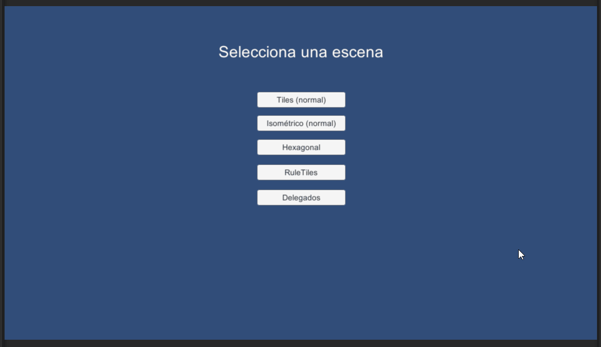

# Eventos en Unity
---
**Demostración:**
1. Tenemos un menú en el que se puede elegir la escena, cada botón desencadena una llamada a una función (con argumento).
2. En cada escena, también tenemos un botón de "Atrás" para volver al menú principal.
3. Dentro del juego, cuando el personaje pisa las flores rojas, hace que una abeja le persiga y que un pájaro salga volando en dirección a la puerta de la casa.
Hay un GameController que gestiona un delegado, que se encargará de llamar a las funciones suscritas una vez sea solicitado.
Tanto la abeja como el pájaro, lo que hacen es modificar el delegado del GameController, indicándole cada uno qué función debe llamarse. *Ejemplo: GameControllerScript.delegado += funcionAEjecutar*

